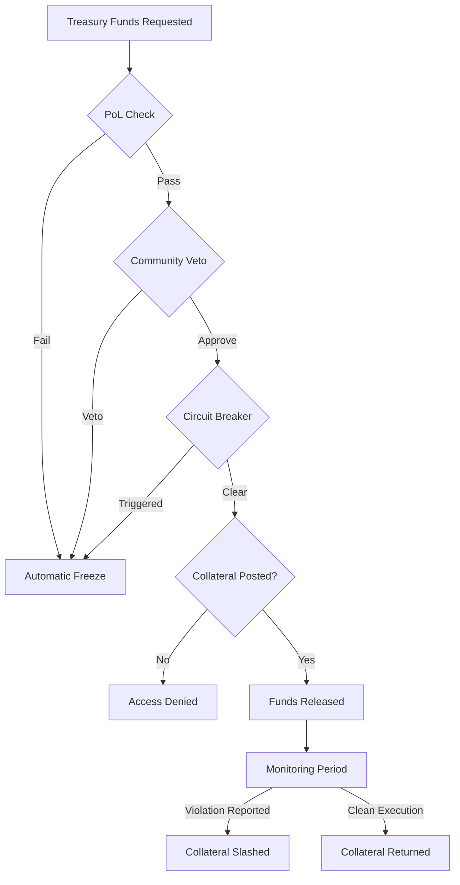

# Detailed Contestation Mechanisms for Holodomor Fund Freezing

## Overview
This document details specific mechanisms through which citizens could have contested and frozen the economic resources used to seal borders and enforce violent policies during the Holodomor.

## 1. Proof-of-Life Treasury Lock (PoL-TL)

### Mechanism Design
- **Sampling Method**: Verifiable Random Function (VRF) selects 1,000 random citizens per region daily
- **Attestation Required**: Selected citizens must submit proof-of-life within 24 hours
- **Threshold**: 70% attestation rate required to maintain treasury access
- **Automatic Response**: Falls below threshold → immediate 7-day fund freeze

### Economic Game Theory
- **Cost to State**: Must maintain infrastructure to ensure citizen survival
- **Cost to Citizens**: Minimal - only selected citizens need to attest
- **Nash Equilibrium**: State incentivized to keep citizens alive to maintain fund access

### Technical Implementation
```solidity
// Pseudocode for attestation check
if (attestationCount[region] < (sampleSize * 70 / 100)) {
    treasuryLocked[region] = true;
    lockExpiry[region] = block.timestamp + 7 days;
    emit EmergencyLockActivated(region, attestationCount[region]);
}
```

### Historical Context Application
- Would have detected mass mortality in Ukrainian regions by December 1932
- Could have frozen funds for NKVD border units preventing peasant movement
- International observers could verify attestation drops remotely

## 2. Decentralized Veto Network (DVN)

### Mechanism Design
- **Structure**: 15-of-25 multisig per oblast (region)
- **Signers**: 5 categories × 5 members each:
  - Elected village representatives
  - Religious leaders
  - Agricultural cooperative heads
  - Medical personnel
  - Teacher representatives
- **Veto Window**: 72-hour public review period for any enforcement fund request
- **Override**: Requires 20-of-25 signatures to bypass veto

### Power Distribution
- **Decentralization**: No single group can control treasury
- **Local Authority**: Communities directly control enforcement in their region
- **Transparency**: All fund requests public with stated purpose

### Practical Application
```
Example Veto Scenario:
1. NKVD requests 50,000 rubles for "border enforcement equipment"
2. Public notification sent to all 25 signers + citizen broadcast
3. Village representatives recognize this as blocking detachment funding
4. 11+ signers refuse to approve → funds blocked
5. State must negotiate or find alternative funding
```

### Historical Prevention
- Would have blocked funding for:
  - Railway car requisitions for grain export
  - NKVD blocking detachment salaries
  - Internal passport system implementation
  - Punitive expedition logistics

## 3. Humanitarian Circuit Breaker (HCB)

### Mechanism Design
- **Metrics Monitored**:
  - Mortality rate: >150% of 3-year average
  - Food price index: >300% of baseline
  - Migration patterns: >500% increase in movement attempts
  - Birth rate: <50% of normal
  - Hospital admissions: >200% for malnutrition

### Automatic Triggers
```
IF (mortality_rate > 1.5 * baseline) OR
   (food_price > 3.0 * baseline) OR
   (migration_attempts > 5.0 * baseline) THEN
   
   treasury.freezeAllEnforcement()
   notify.internationalObservers()
   require.supermajorityOverride()
```

### Override Mechanism
- **Required**: 75% vote from all regions
- **Stake Required**: 1,000 ETH equivalent per official
- **Time Limit**: 24-hour emergency access only
- **Penalty**: Stake slashed if metrics worsen

### Data Sources (Historical Equivalent)
- Church death records
- Market price logs
- Railway passenger manifests
- Hospital records
- Agricultural production reports

## 4. Whistleblower Protection & Bounty System (WPBS)

### Mechanism Design
- **Anonymous Submission**: Zero-knowledge proof of regional residence
- **Evidence Types**:
  - Photo evidence (stored on IPFS)
  - Document scans (procurement orders, directives)
  - Audio recordings
  - Written testimonies (notarized)
- **Verification**: 3-of-5 random validators review evidence
- **Bounty Structure**:
  - Base: 10 ETH equivalent
  - Severity multiplier: 1x-10x based on violation
  - Speed bonus: 2x if reported within 24 hours

### Protection Mechanisms
- **Ring Signatures**: Hide reporter among 100 possible citizens
- **Time Delays**: Random 1-7 day delay before publication
- **Dead Man's Switch**: Automatic release if reporter doesn't check in
- **Encrypted Storage**: Evidence encrypted until validation

### Incentive Alignment
```
Reporter Payoff Matrix:
                    State Retaliates    State Complies
Report Truth        +Bounty/-Risk       +Bounty/+Reputation  
Report False        -Stake/-Reputation  -Stake/-Reputation
Don't Report        0/+Risk             0/0
```

### Historical Application
- NKVD violence at collection points
- Mass shootings of fleeing peasants
- Destruction of food stores
- Forced deportations

## 5. Collateralized Enforcement Bonds (CEB)

### Mechanism Design
- **Collateral Requirements**:
  - Local enforcement: 20% of funds requested
  - Regional enforcement: 35% of funds requested
  - Inter-regional operations: 50% of funds requested
- **Lock Period**: 30 days post-operation
- **Slashing Conditions**:
  - Verified violence: 100% slash
  - Excessive force: 50% slash
  - Procedural violations: 25% slash

### Risk Transfer
```
Official's Decision Tree:
├── Request 100,000 rubles for enforcement
│   ├── Post 20,000 ruble collateral
│   │   ├── Execute peacefully → Recover collateral
│   │   └── Use violence → Lose collateral + criminal liability
│   └── Don't post collateral → No funds accessed
```

### Accountability Chain
1. Official posts personal assets as collateral
2. Community monitors enforcement action
3. Evidence of violations submitted
4. Arbitration court reviews
5. Collateral slashed and distributed to victims

### Historical Prevention Effect
- Would have made officials personally liable for:
  - Grain requisition violence
  - Border shooting orders
  - Village collective punishment
  - Forced labor camps

## 6. Composite Defense Strategy

### Layered Protection
Citizens would have multiple simultaneous mechanisms:



### Synergistic Effects
- **Multiple Veto Points**: Any mechanism can stop violence funding
- **Overlapping Coverage**: Different mechanisms catch different violations
- **Escalating Costs**: Each override attempt becomes more expensive
- **Network Effects**: More participation → stronger protection

## Economic Analysis

### Cost-Benefit for State
```
Traditional Enforcement:
- Cost: X rubles
- Success Rate: High
- International Standing: Low
- Long-term Stability: Low

With Contestation System:
- Cost: X + Collateral + Risk of Freeze
- Success Rate: Lower
- International Standing: Higher
- Long-term Stability: Higher
```

### Citizen Coordination Benefits
- **Information Sharing**: Evidence spreads rapidly
- **Collective Action**: Individual risk reduced
- **Economic Leverage**: Direct control over state resources
- **International Support**: Transparent system attracts aid

## Implementation Timeline (Hypothetical Historical)

### Phase 1 (Pre-1932): System Deployment
- Deploy smart contracts to regional nodes
- Register initial citizen validators
- Establish international observer connections

### Phase 2 (Early 1932): Active Monitoring
- Begin attestation cycles
- First treasury freeze from low attestations
- Initial whistleblower reports filed

### Phase 3 (Mid-1932): Crisis Response
- Humanitarian circuit breakers trigger
- Mass veto of enforcement funds
- International intervention activated

### Phase 4 (Late 1932): Full Lockdown
- Complete treasury freeze
- Collateral slashing for violations
- Emergency food distribution funded by frozen assets

## Conclusion

These mechanisms would have provided multiple, redundant ways for citizens to contest and freeze funds used for violent enforcement during the Holodomor. By making violence economically expensive and personally risky for officials, while providing safe channels for resistance, the system could have prevented or significantly reduced the humanitarian catastrophe.

The key innovation is transforming the state's monopoly on violence funding into a system requiring continuous citizen consent, verified through cryptographic proofs and economic incentives.