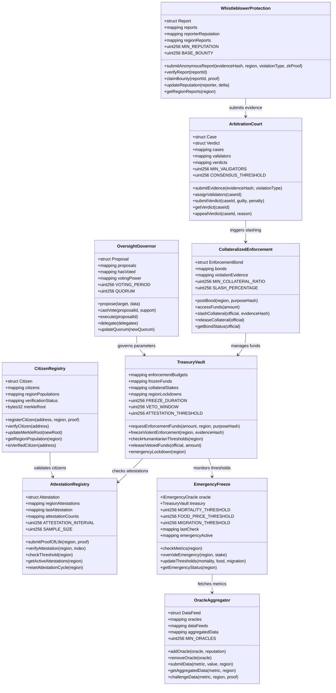
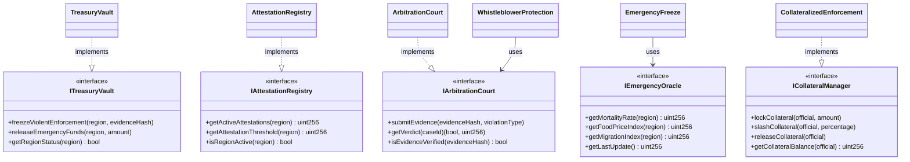
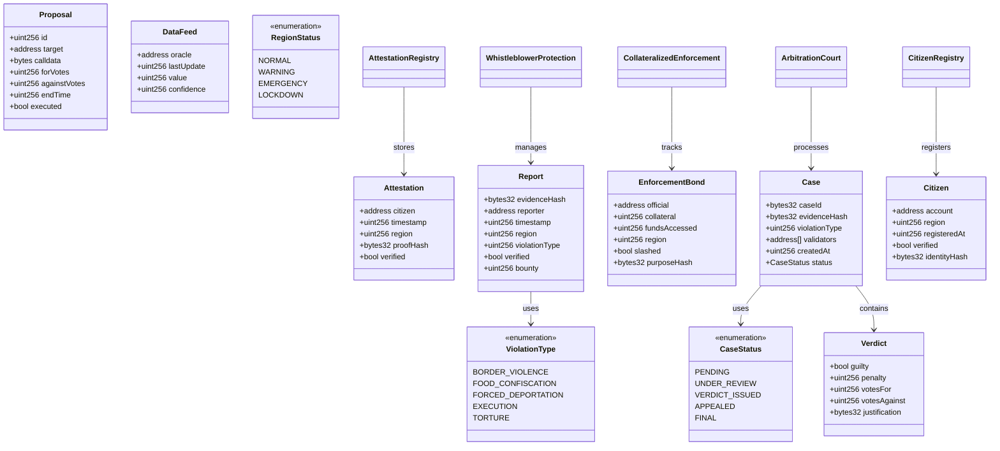
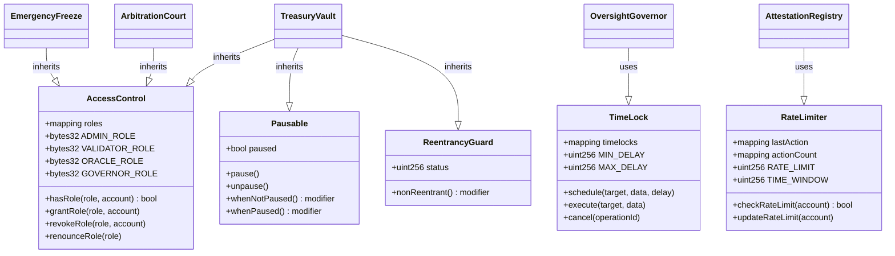
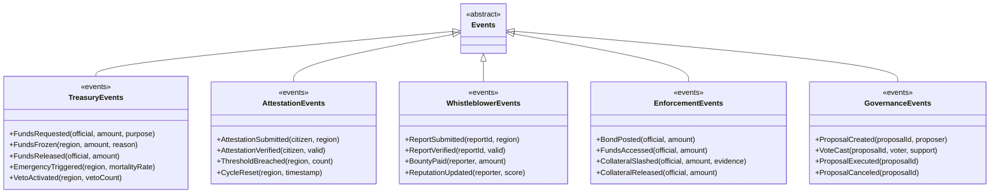

# Holodomor Oversight System - Class Diagrams

## Core Contract Architecture

```mermaid
classDiagram
    class TreasuryVault {
        +mapping enforcementBudgets
        +mapping frozenFunds
        +mapping collateralStakes
        +mapping regionLockdowns
        +uint256 FREEZE_DURATION
        +uint256 VETO_WINDOW
        +uint256 ATTESTATION_THRESHOLD
        +requestEnforcementFunds(amount, region, purposeHash)
        +freezeViolentEnforcement(region, evidenceHash)
        +checkHumanitarianThresholds(region)
        +releaseVetoedFunds(official, amount)
        +emergencyLockdown(region)
    }
    
    class OversightGovernor {
        +struct Proposal
        +mapping proposals
        +mapping hasVoted
        +mapping votingPower
        +uint256 VOTING_PERIOD
        +uint256 QUORUM
        +propose(target, data)
        +castVote(proposalId, support)
        +execute(proposalId)
        +delegate(delegatee)
        +updateQuorum(newQuorum)
    }
    
    class AttestationRegistry {
        +struct Attestation
        +mapping regionAttestations
        +mapping lastAttestation
        +mapping attestationCounts
        +uint256 ATTESTATION_INTERVAL
        +uint256 SAMPLE_SIZE
        +submitProofOfLife(region, proof)
        +verifyAttestation(region, index)
        +checkThreshold(region)
        +getActiveAttestations(region)
        +resetAttestationCycle(region)
    }
    
    class EmergencyFreeze {
        +IEmergencyOracle oracle
        +TreasuryVault treasury
        +uint256 MORTALITY_THRESHOLD
        +uint256 FOOD_PRICE_THRESHOLD
        +uint256 MIGRATION_THRESHOLD
        +mapping lastCheck
        +mapping emergencyActive
        +checkMetrics(region)
        +overrideEmergency(region, stake)
        +updateThresholds(mortality, food, migration)
        +getEmergencyStatus(region)
    }
    
    class WhistleblowerProtection {
        +struct Report
        +mapping reports
        +mapping reporterReputation
        +mapping regionReports
        +uint256 MIN_REPUTATION
        +uint256 BASE_BOUNTY
        +submitAnonymousReport(evidenceHash, region, violationType, zkProof)
        +verifyReport(reportId)
        +claimBounty(reportId, proof)
        +updateReputation(reporter, delta)
        +getRegionReports(region)
    }
    
    class CollateralizedEnforcement {
        +struct EnforcementBond
        +mapping bonds
        +mapping violationEvidence
        +uint256 MIN_COLLATERAL_RATIO
        +uint256 SLASH_PERCENTAGE
        +postBond(region, purposeHash)
        +accessFunds(amount)
        +slashCollateral(official, evidenceHash)
        +releaseCollateral(official)
        +getBondStatus(official)
    }
    
    class ArbitrationCourt {
        +struct Case
        +struct Verdict
        +mapping cases
        +mapping validators
        +mapping verdicts
        +uint256 MIN_VALIDATORS
        +uint256 CONSENSUS_THRESHOLD
        +submitEvidence(evidenceHash, violationType)
        +assignValidators(caseId)
        +submitVerdict(caseId, guilty, penalty)
        +getVerdict(caseId)
        +appealVerdict(caseId, reason)
    }
    
    class CitizenRegistry {
        +struct Citizen
        +mapping citizens
        +mapping regionPopulations
        +mapping verificationStatus
        +bytes32 merkleRoot
        +registerCitizen(address, region, proof)
        +verifyCitizen(address)
        +updateMerkleRoot(newRoot)
        +getRegionPopulation(region)
        +isVerifiedCitizen(address)
    }
    
    class OracleAggregator {
        +struct DataFeed
        +mapping oracles
        +mapping dataFeeds
        +mapping aggregatedData
        +uint256 MIN_ORACLES
        +addOracle(oracle, reputation)
        +removeOracle(oracle)
        +submitData(metric, value, region)
        +getAggregatedData(metric, region)
        +challengeData(metric, region, proof)
    }
    
    TreasuryVault --> AttestationRegistry : checks attestations
    TreasuryVault --> EmergencyFreeze : monitors thresholds
    EmergencyFreeze --> OracleAggregator : fetches metrics
    WhistleblowerProtection --> ArbitrationCourt : submits evidence
    CollateralizedEnforcement --> TreasuryVault : manages funds
    ArbitrationCourt --> CollateralizedEnforcement : triggers slashing
    OversightGovernor --> TreasuryVault : governs parameters
    CitizenRegistry --> AttestationRegistry : validates citizens
```

## Interface Relationships

```mermaid
classDiagram
    class IAttestationRegistry {
        <<interface>>
        +getActiveAttestations(region) uint256
        +getAttestationThreshold(region) uint256
        +isRegionActive(region) bool
    }
    
    class IEmergencyOracle {
        <<interface>>
        +getMortalityRate(region) uint256
        +getFoodPriceIndex(region) uint256
        +getMigrationIndex(region) uint256
        +getLastUpdate() uint256
    }
    
    class IArbitrationCourt {
        <<interface>>
        +submitEvidence(evidenceHash, violationType)
        +getVerdict(caseId) (bool, uint256)
        +isEvidenceVerified(evidenceHash) bool
    }
    
    class ITreasuryVault {
        <<interface>>
        +freezeViolentEnforcement(region, evidenceHash)
        +releaseEmergencyFunds(region, amount)
        +getRegionStatus(region) bool
    }
    
    class ICollateralManager {
        <<interface>>
        +lockCollateral(official, amount)
        +slashCollateral(official, percentage)
        +releaseCollateral(official)
        +getCollateralBalance(official) uint256
    }
    
    TreasuryVault ..|> ITreasuryVault : implements
    AttestationRegistry ..|> IAttestationRegistry : implements
    ArbitrationCourt ..|> IArbitrationCourt : implements
    EmergencyFreeze --> IEmergencyOracle : uses
    WhistleblowerProtection --> IArbitrationCourt : uses
    CollateralizedEnforcement ..|> ICollateralManager : implements
```

## Data Structures

```mermaid
classDiagram
    class Attestation {
        +address citizen
        +uint256 timestamp
        +uint256 region
        +bytes32 proofHash
        +bool verified
    }
    
    class Report {
        +bytes32 evidenceHash
        +address reporter
        +uint256 timestamp
        +uint256 region
        +uint256 violationType
        +bool verified
        +uint256 bounty
    }
    
    class EnforcementBond {
        +address official
        +uint256 collateral
        +uint256 fundsAccessed
        +uint256 region
        +bool slashed
        +bytes32 purposeHash
    }
    
    class Proposal {
        +uint256 id
        +address target
        +bytes calldata
        +uint256 forVotes
        +uint256 againstVotes
        +uint256 endTime
        +bool executed
    }
    
    class Case {
        +bytes32 caseId
        +bytes32 evidenceHash
        +uint256 violationType
        +address[] validators
        +uint256 createdAt
        +CaseStatus status
    }
    
    class Verdict {
        +bool guilty
        +uint256 penalty
        +uint256 votesFor
        +uint256 votesAgainst
        +bytes32 justification
    }
    
    class Citizen {
        +address account
        +uint256 region
        +uint256 registeredAt
        +bool verified
        +bytes32 identityHash
    }
    
    class DataFeed {
        +address oracle
        +uint256 lastUpdate
        +uint256 value
        +uint256 confidence
    }
    
    class ViolationType {
        <<enumeration>>
        BORDER_VIOLENCE
        FOOD_CONFISCATION
        FORCED_DEPORTATION
        EXECUTION
        TORTURE
    }
    
    class CaseStatus {
        <<enumeration>>
        PENDING
        UNDER_REVIEW
        VERDICT_ISSUED
        APPEALED
        FINAL
    }
    
    class RegionStatus {
        <<enumeration>>
        NORMAL
        WARNING
        EMERGENCY
        LOCKDOWN
    }
    
    Report --> ViolationType : uses
    Case --> CaseStatus : uses
    Case --> Verdict : contains
    AttestationRegistry --> Attestation : stores
    WhistleblowerProtection --> Report : manages
    CollateralizedEnforcement --> EnforcementBond : tracks
    ArbitrationCourt --> Case : processes
    CitizenRegistry --> Citizen : registers
```

## Access Control & Modifiers

```mermaid
classDiagram
    class AccessControl {
        +mapping roles
        +bytes32 ADMIN_ROLE
        +bytes32 VALIDATOR_ROLE
        +bytes32 ORACLE_ROLE
        +bytes32 GOVERNOR_ROLE
        +hasRole(role, account) bool
        +grantRole(role, account)
        +revokeRole(role, account)
        +renounceRole(role)
    }
    
    class Pausable {
        +bool paused
        +pause()
        +unpause()
        +whenNotPaused() modifier
        +whenPaused() modifier
    }
    
    class ReentrancyGuard {
        +uint256 status
        +nonReentrant() modifier
    }
    
    class TimeLock {
        +mapping timelocks
        +uint256 MIN_DELAY
        +uint256 MAX_DELAY
        +schedule(target, data, delay)
        +execute(target, data)
        +cancel(operationId)
    }
    
    class RateLimiter {
        +mapping lastAction
        +mapping actionCount
        +uint256 RATE_LIMIT
        +uint256 TIME_WINDOW
        +checkRateLimit(account) bool
        +updateRateLimit(account)
    }
    
    TreasuryVault --|> AccessControl : inherits
    TreasuryVault --|> Pausable : inherits
    TreasuryVault --|> ReentrancyGuard : inherits
    OversightGovernor --|> TimeLock : uses
    AttestationRegistry --|> RateLimiter : uses
    EmergencyFreeze --|> AccessControl : inherits
    ArbitrationCourt --|> AccessControl : inherits
```

## Event System

```mermaid
classDiagram
    class Events {
        <<abstract>>
    }
    
    class TreasuryEvents {
        <<events>>
        +FundsRequested(official, amount, purpose)
        +FundsFrozen(region, amount, reason)
        +FundsReleased(official, amount)
        +EmergencyTriggered(region, mortalityRate)
        +VetoActivated(region, vetoCount)
    }
    
    class AttestationEvents {
        <<events>>
        +AttestationSubmitted(citizen, region)
        +AttestationVerified(citizen, valid)
        +ThresholdBreached(region, count)
        +CycleReset(region, timestamp)
    }
    
    class WhistleblowerEvents {
        <<events>>
        +ReportSubmitted(reportId, region)
        +ReportVerified(reportId, valid)
        +BountyPaid(reporter, amount)
        +ReputationUpdated(reporter, score)
    }
    
    class EnforcementEvents {
        <<events>>
        +BondPosted(official, amount)
        +FundsAccessed(official, amount)
        +CollateralSlashed(official, amount, evidence)
        +CollateralReleased(official, amount)
    }
    
    class GovernanceEvents {
        <<events>>
        +ProposalCreated(proposalId, proposer)
        +VoteCast(proposalId, voter, support)
        +ProposalExecuted(proposalId)
        +ProposalCanceled(proposalId)
    }
    
    Events <|-- TreasuryEvents
    Events <|-- AttestationEvents
    Events <|-- WhistleblowerEvents
    Events <|-- EnforcementEvents
    Events <|-- GovernanceEvents
```