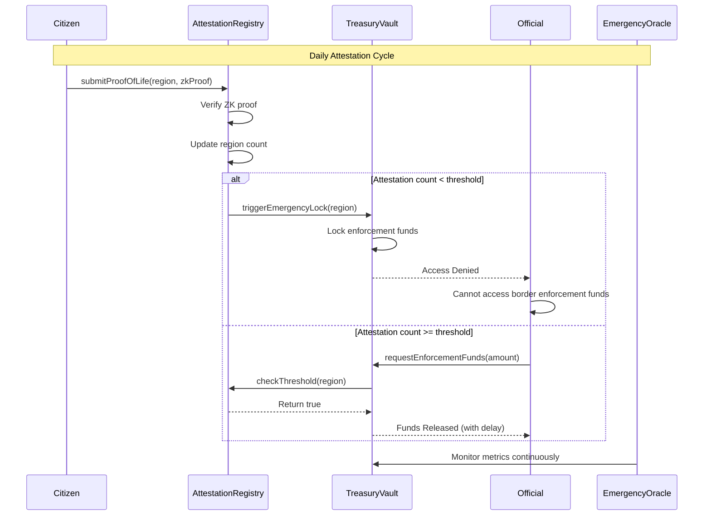
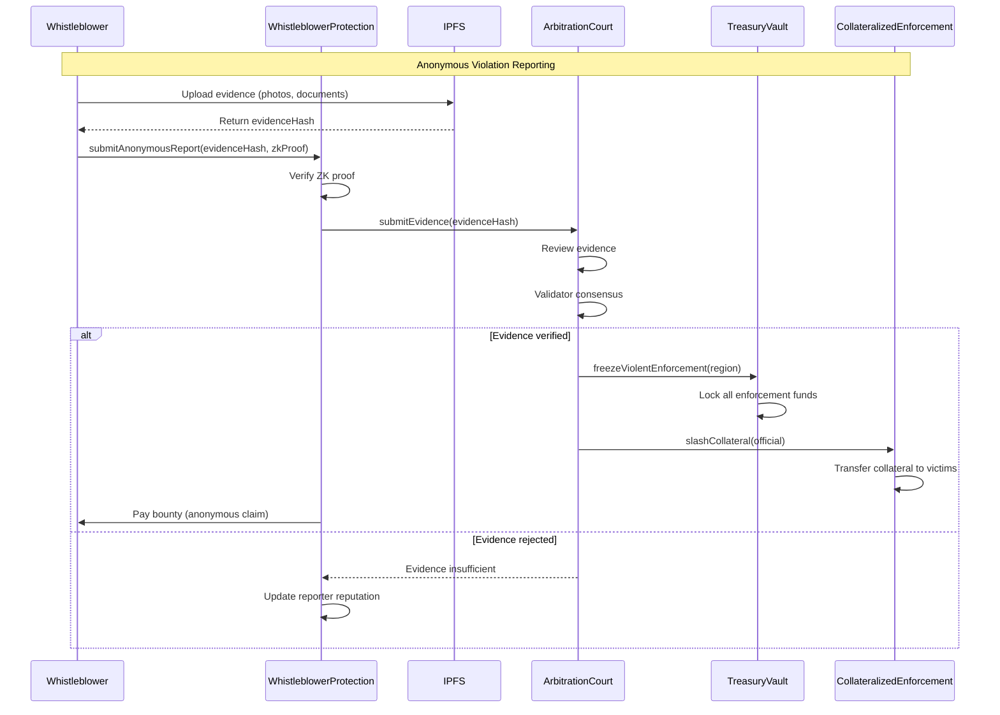
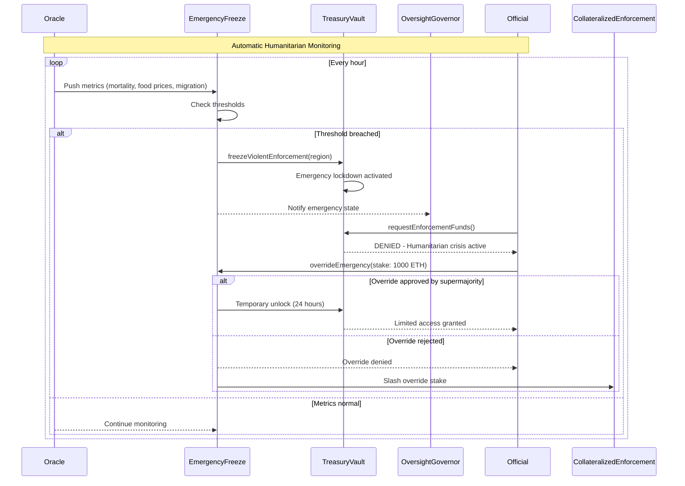
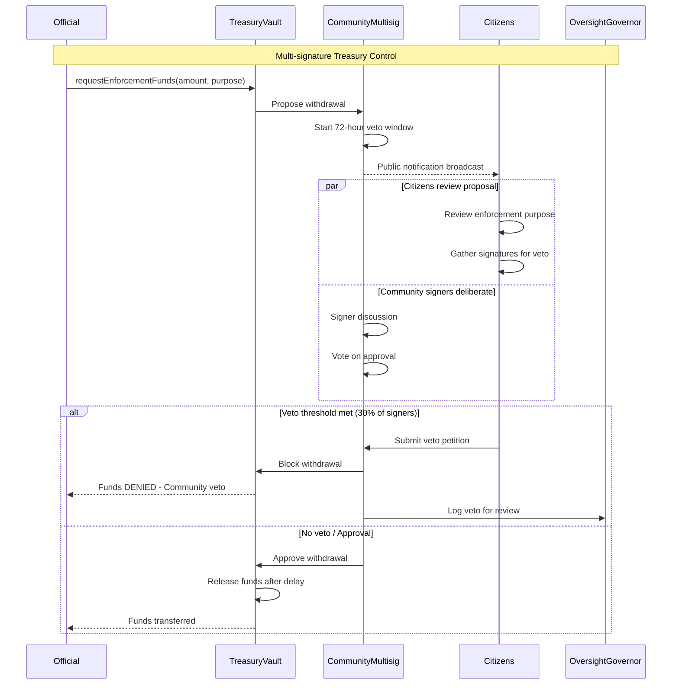
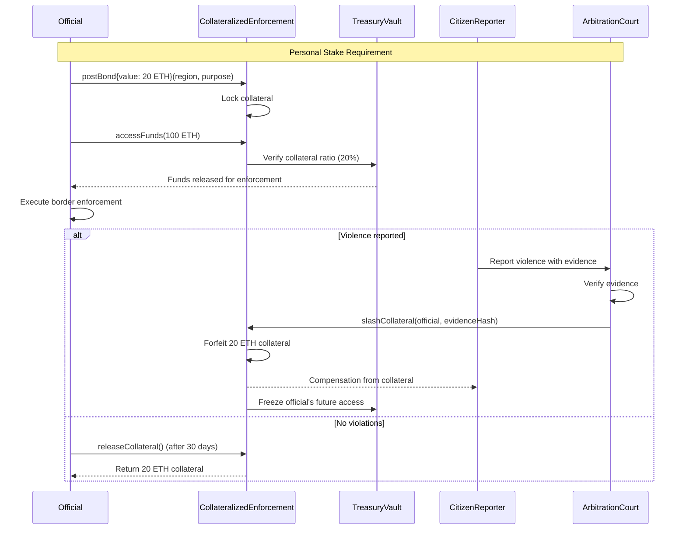
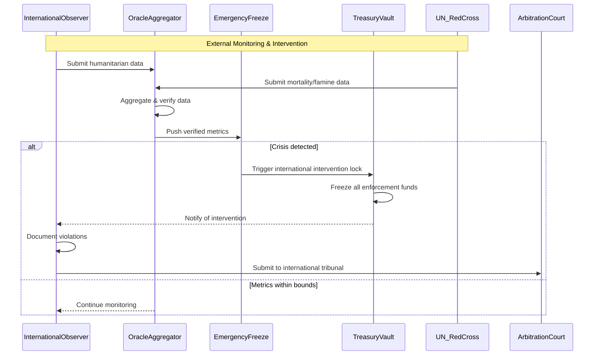

# Holodomor Oversight System - Sequence Diagrams

## 1. Proof-of-Life Treasury Lock Flow

## 2. Whistleblower Report & Fund Freeze Flow

## 3. Humanitarian Circuit Breaker Flow

## 4. Community Veto Network Flow

## 5. Collateralized Enforcement Bond Flow

## 6. International Observer Integration Flow

