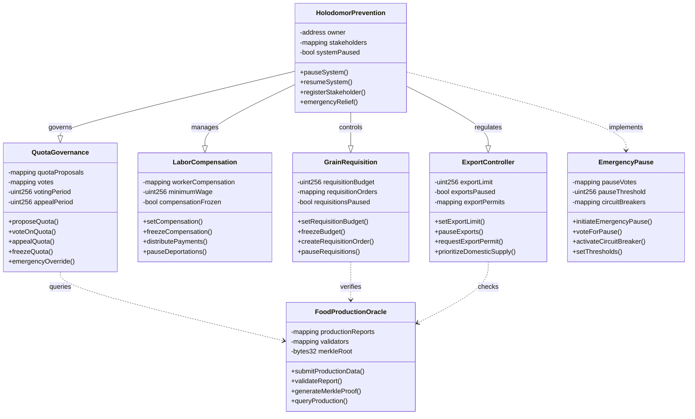
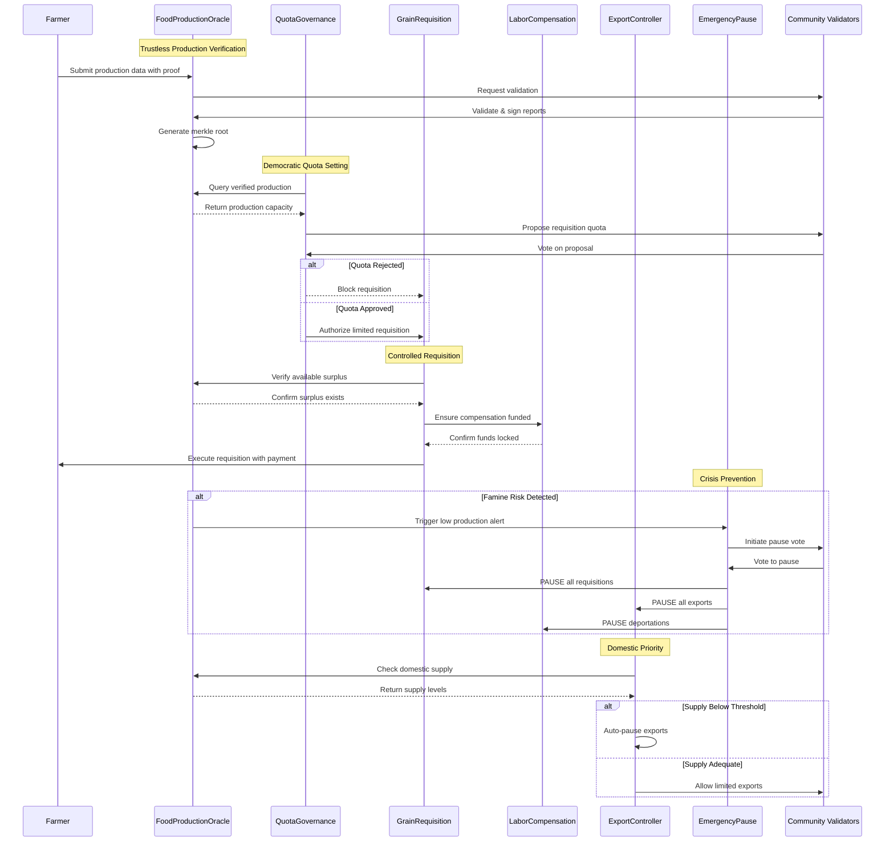

# Holodomor Prevention Architecture - Solidity Smart Contract System

## Overview
A decentralized system to prevent famine atrocities through transparent governance, cryptographic verification, and emergency pause mechanisms. This architecture ensures no single authority can impose deadly requisition quotas without oversight and appeal.

## Class Diagram

## Sequence Diagram - Preventing Forced Requisitions

## Key Features

### 1. Cryptographic Production Verification
- Merkle tree proofs for production data
- Multi-validator consensus on harvest reports
- Immutable on-chain production history
- Prevents false reporting and trust spirals

### 2. Democratic Quota Governance
- Community voting on requisition quotas
- Appeal mechanisms for unfair quotas
- Time-locked voting periods
- Emergency override capabilities

### 3. Frozen Budget Controls
- Requisition budgets can be frozen
- Labor compensation protected from seizure
- Minimum wage guarantees
- Automated payment distribution

### 4. Emergency Pause Mechanisms
- Multi-signature pause activation
- Circuit breakers for crisis conditions
- Automatic export halts during shortages
- Deportation freezes

### 5. Export Controls
- Domestic supply prioritization
- Export permits require surplus verification
- Automatic pauses when production falls
- Foreign currency limits

### 6. Transparency & Accountability
- All requisitions recorded on-chain
- Public audit trail of decisions
- Validator reputation system
- Compensation tracking

## Security Measures

1. **Multi-signature Requirements**: Critical functions require multiple approvals
2. **Time Locks**: Major changes subject to delay periods for review
3. **Circuit Breakers**: Automatic pauses triggered by anomalous conditions
4. **Slashing Conditions**: Penalties for false reporting or malicious behavior
5. **Emergency Recovery**: Mechanisms to restore system after crisis

## Implementation Contracts

1. `HolodomorPrevention.sol` - Main orchestration contract
2. `GrainRequisition.sol` - Manages grain collection with limits
3. `LaborCompensation.sol` - Ensures fair payment and prevents forced labor
4. `QuotaGovernance.sol` - Democratic decision-making on quotas
5. `FoodProductionOracle.sol` - Cryptographic verification of production
6. `ExportController.sol` - Manages foreign trade with domestic priority
7. `EmergencyPause.sol` - Crisis response mechanisms