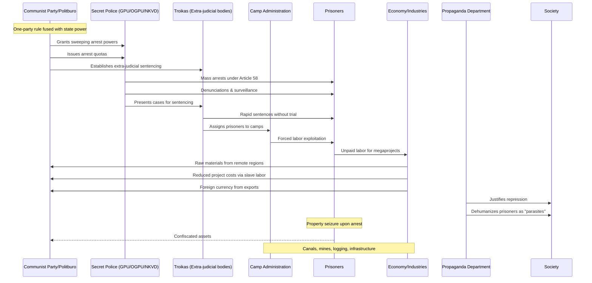

# Issue: The GULAG System - Complicit Parties and Resource Flows

## Summary
The GULAG system was a sprawling network of forced-labor camps used for incarceration, social control, and economic exploitation. This issue documents the complicit parties and resource flows that enabled this atrocity.

## Sequence Diagram of Complicit Parties and Resource Flows

## Key Resource Flows

### Economic Resources
- **State monopoly** over land, natural resources, rail, and industry
- **Seized property** from prisoners reducing fiscal costs
- **Unpaid labor** for priority projects (canals, mines, logging)
- **Raw material extraction** from Siberia and Far North using coerced labor

### Authority Resources
- **Article 58** as catch-all offense for "counter-revolutionary activity"
- **Bureaucratic quotas** for arrests and executions
- **Internal passport regime** restricting movement
- **Censorship and propaganda** to justify repression

### Power Dynamics
- **Rule by terror** and fear of denunciation
- **Incentivized informant networks**
- **Center-periphery asymmetry** with Moscow directing extraction from distant regions
- **Dehumanization rhetoric** legitimizing extreme exploitation

## Impact
- Millions imprisoned and subjected to forced labor
- Economic exploitation of remote regions otherwise too costly to develop
- Social control through terror and surveillance
- Normalization of extra-judicial punishment