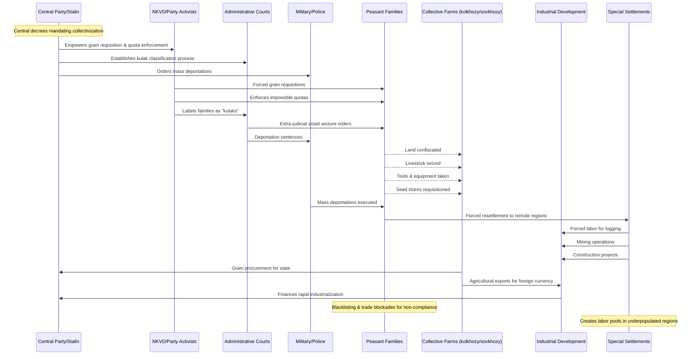

# Issue: Collectivization, Dekulakization & Special Settlements - Complicit Parties and Resource Flows

## Summary
Forced consolidation of peasant farms into collectives, liquidation and deportation of "kulaks" (successful peasants), and mass resettlement of targeted nationalities. This issue documents the complicit parties and resource flows enabling these atrocities.

## Sequence Diagram of Complicit Parties and Resource Flows

## Key Resource Flows

### Economic Resources
- **Confiscated assets**: Land, livestock, tools, seed, stores converted to state control
- **Grain procurement**: Extracted for export to finance industrialization
- **Foreign currency**: From agricultural exports to purchase machinery/factories
- **Forced labor pools**: Created via resettlement for logging, mining, construction

### Authority Resources
- **Central decrees** mandating collectivization
- **NKVD enforcement powers** for requisition and quotas
- **Administrative courts** for asset seizure without due process
- **Military/police powers** for mass deportations

### Power Dynamics
- **"Class war" ideology** enabling violence against neighbors
- **Weaponized social envy** against successful peasants
- **Blacklisting and blockade detachments** punishing entire villages
- **Nationalities policy** targeting perceived separatism
- **Collective punishment** normalized across communities

## Impact
- Millions of peasants dispossessed and deported
- Traditional agricultural systems destroyed
- Creation of forced labor pools in remote regions
- Foundation for subsequent famines through agricultural disruption
- Ethnic minorities targeted for perceived disloyalty