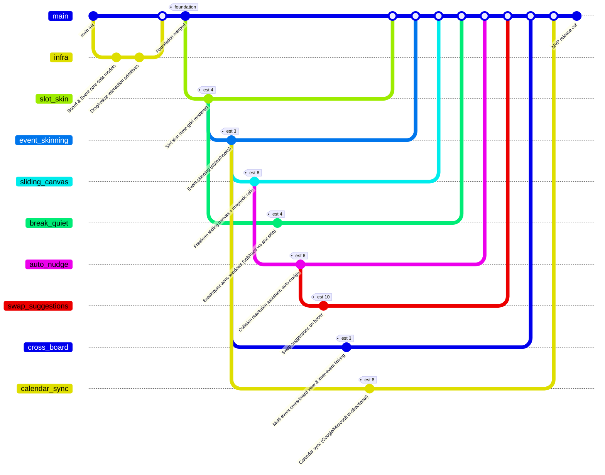

```mermaid
gitGraph
   commit id: "main init"

   %% Foundations
   branch infra
   checkout infra
   commit id: "Board & Event core data models"
   commit id: "Drag/resize interaction primitives"

   checkout main
   merge infra
   commit id: "Foundation merged" tag: "foundation"

   %% Base feature tracks (parallelizable)
   branch slot_skin
   checkout slot_skin
   commit id: "Slot skin (time-grid renderer)" tag: "est 4"

   branch event_skinning
   checkout event_skinning
   commit id: "Event skinning (styles/hooks)" tag: "est 3"

   branch sliding_canvas
   checkout sliding_canvas
   commit id: "Freeform sliding canvas + magnetic rails" tag: "est 6"

   %% Dependent branches
   checkout slot_skin
   branch break_quiet
   checkout break_quiet
   commit id: "Break/quiet-zone windows (soft/hard via slot skin)" tag: "est 4"

   checkout sliding_canvas
   branch auto_nudge
   checkout auto_nudge
   commit id: "Collision resolution assistant: auto-nudge" tag: "est 6"

   checkout auto_nudge
   branch swap_suggestions
   checkout swap_suggestions
   commit id: "Swap suggestions on hover" tag: "est 10"

   checkout event_skinning
   branch cross_board
   checkout cross_board
   commit id: "Multi-event cross-board view & inter-event linking" tag: "est 3"

   checkout event_skinning
   branch calendar_sync
   checkout calendar_sync
   commit id: "Calendar sync (Google/Microsoft bi-directional)" tag: "est 8"

   %% Merge order honoring dependencies
   checkout main
   merge slot_skin
   merge event_skinning
   merge sliding_canvas
   merge break_quiet
   merge auto_nudge
   merge swap_suggestions
   merge cross_board
   merge calendar_sync

   commit id: "MVP release cut"
```