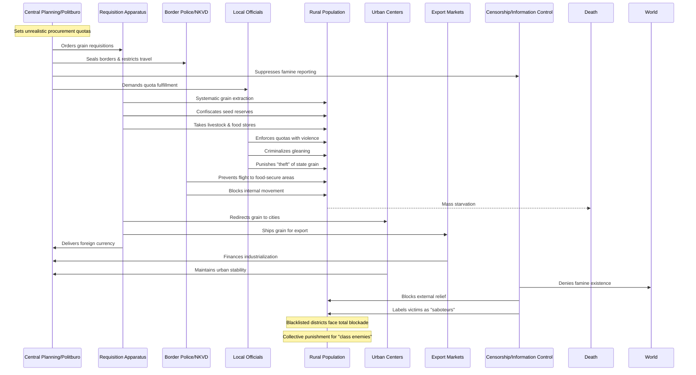

# Issue: The Great Famine (1932-33, including Holodomor) - Complicit Parties and Resource Flows

## Summary
A man-made famine resulting from aggressive grain requisitions, punitive quotas, market abolition, and movement restrictions that devastated Ukraine, Kazakhstan, and other regions. This issue documents the complicit parties and resource flows that enabled this genocidal atrocity.

## Sequence Diagram of Complicit Parties and Resource Flows

## Key Resource Flows

### Economic Resources
- **Grain exports** prioritized over rural survival for foreign currency
- **Industrial financing** through agricultural extraction
- **Urban food supply** maintained at rural expense
- **Confiscated reserves**: Seed, livestock, all foodstuffs taken
- **Railway/warehouse infrastructure** enabling systematic extraction

### Authority Resources
- **Central plans** with impossible procurement targets
- **Border sealing orders** trapping populations
- **Movement restrictions** via internal passports
- **Criminalization** of survival activities (gleaning, "theft")
- **Information monopoly** suppressing famine reporting

### Power Dynamics
- **Differential punishment**: Blacklisted districts faced total blockade
- **Targeted regions**: Ukraine, Kazakhstan as perceived nationalist threats
- **"Class enemy" narrative**: Kulaks blamed and targeted
- **Victim blaming**: Starving labeled as "idlers" and "wreckers"
- **Information control**: Censorship preventing external intervention
- **Collective responsibility**: Entire villages punished for quota failures

## Impact
- **Millions dead** from deliberate starvation (estimates 3.5-7 million)
- **Ukraine particularly devastated** (Holodomor)
- **Kazakhstan lost ~1.5 million** (40% of population)
- **Agricultural capacity destroyed** for generations
- **Cultural genocide** through targeting of national minorities
- **International denial** enabled by information control