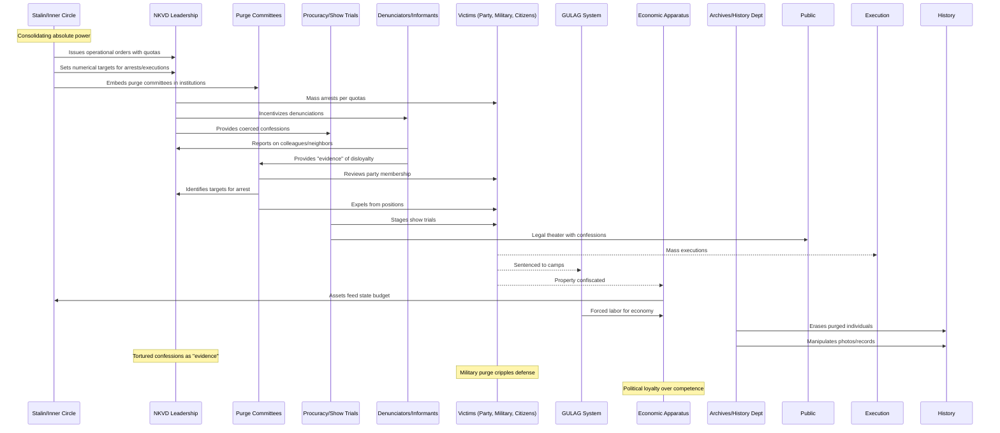

# Issue: The Great Purge (1936-38) - Complicit Parties and Resource Flows

## Summary
Mass arrests, show trials, executions, and camp sentences against party elites, military officers, intellectuals, and ordinary citizens to decapitate independent centers of power. This issue documents the complicit parties and resource flows enabling this terror.

## Sequence Diagram of Complicit Parties and Resource Flows

## Key Resource Flows

### Economic Resources
- **Confiscated property** of condemned feeding state budget
- **Forced labor** from condemned feeding camp economy
- **Vacated positions** filled by political loyalists
- **Industrial control** centralized despite inefficiency

### Authority Resources
- **NKVD operational orders** with arrest/execution quotas (e.g., Order 00447)
- **Show trial apparatus** providing legal theater
- **Purge committees** embedded across all institutions
- **Party membership** weaponized as trap and tool

### Power Dynamics
- **Paranoia as policy**: Ubiquitous surveillance and self-policing
- **Denunciation incentives**: Career advancement through betrayal
- **Photo/archival manipulation**: Monopoly on historical narrative
- **Military decapitation**: 3 of 5 marshals, 90% of generals eliminated
- **Cascading terror**: Each arrest triggering more through "connections"
- **Coerced confessions**: Torture producing "evidence" for more arrests

## Impact
- **750,000+ executed** in 1937-38 alone
- **Millions more** sent to GULAG camps
- **Military leadership destroyed** before WWII
- **Technical expertise eliminated** hampering development
- **Social atomization** through universal fear
- **Historical erasure** of victims from records
- **Institutional paralysis** from fear of initiative