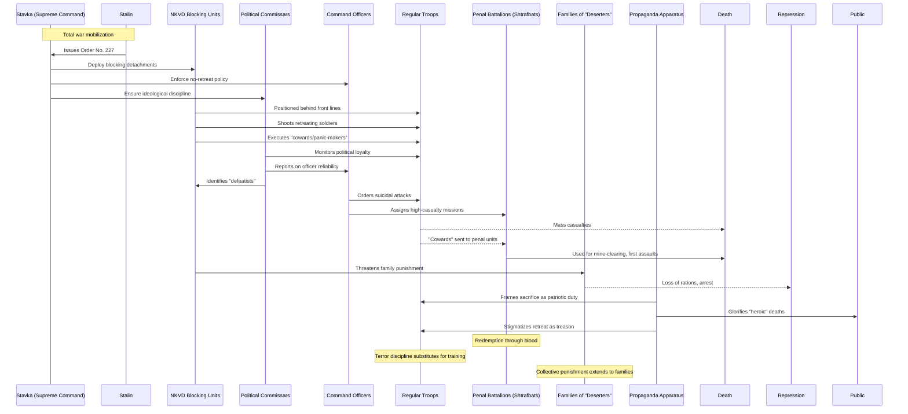

# Issue: Order No. 227 ("Not One Step Back!", 1942) - Complicit Parties and Resource Flows

## Summary
A wartime decree imposing blocking detachments, penal battalions, and on-the-spot executions to stop retreats during WWII. This issue documents the complicit parties and resource flows enabling this brutal enforcement of military discipline through terror.

## Sequence Diagram of Complicit Parties and Resource Flows

## Key Resource Flows

### Human Resources as Expendable Input
- **Manpower treated as disposable**: Penal units for high-casualty operations
- **Conservation of trained units** through sacrifice of penal battalions
- **Mine-clearing with bodies** instead of equipment
- **Forced attacks** to tie down enemy forces regardless of losses

### Authority Resources
- **Stavka emergency powers** during wartime
- **NKVD blocking units** with execution authority
- **Political commissars** enforcing dual command
- **Military tribunals** for rapid sentencing

### Power Dynamics
- **Total war ideology**: Military obedience fused with political loyalty
- **Terror as discipline**: Fear substituting for training/equipment
- **Collective punishment**: Families of "deserters" targeted
- **Propaganda framing**: Sacrifice glorified as patriotic necessity
- **No retreat mentality**: Tactical flexibility sacrificed for ideological purity
- **Redemption through blood**: Penal service as only path to rehabilitation

## Impact
- **Massive unnecessary casualties** from inflexible tactics
- **Blocking detachments killed thousands** of own troops
- **Penal battalions suffered 50-75% casualty rates**
- **Military effectiveness compromised** by terror discipline
- **Family persecution** extending punishment beyond combatants
- **Psychological trauma** from threat of execution by own forces
- **Tactical rigidity** contributing to early war disasters