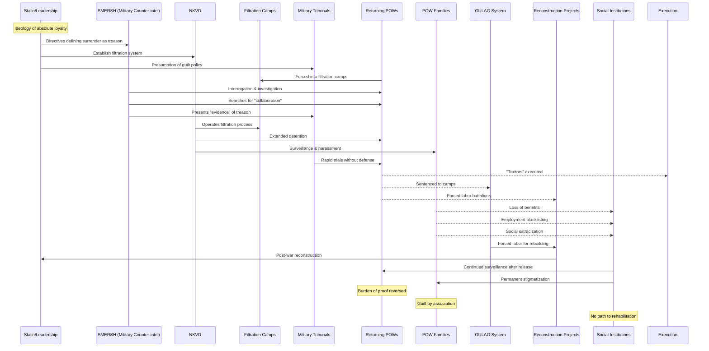

# Issue: Punishing Prisoners of War - Complicit Parties and Resource Flows

## Summary
Returning Soviet POWs were filtered as potential traitors, with many imprisoned, sent to labor camps, or executed. Stigma extended to families. This issue documents the complicit parties and resource flows enabling this persecution of war victims.

## Sequence Diagram of Complicit Parties and Resource Flows

## Key Resource Flows

### Human Resources Exploitation
- **Forced labor** from POWs for reconstruction
- **Labor battalions** for dangerous post-war work
- **GULAG expansion** with returning POWs
- **Loss of skilled workers** through persecution

### Authority Resources
- **Early-war orders** defining surrender as treason (Order 270)
- **SMERSH filtration authority** without oversight
- **Military tribunals** with presumption of guilt
- **NKVD surveillance apparatus** extended to families

### Power Dynamics
- **Inverted victimhood**: POW status equated with betrayal
- **Ideological purity test**: Survival itself suspicious
- **Burden of proof reversed**: Must prove innocence
- **Social control through stigma**: Permanent marking
- **Family collective punishment**: Guilt by association
- **State monopoly on records**: No independent rehabilitation
- **Employment gatekeeping**: Economic survival controlled

## Impact
- **1.5+ million POWs** subjected to filtration
- **~300,000 sent to GULAG** or execution
- **Remainder faced lifelong discrimination**
- **Families lost benefits and faced persecution**
- **Psychological trauma** from victim-blaming
- **Social atomization** through fear of association
- **Lost expertise** from persecution of officers/specialists
- **Generational stigma** affecting children of POWs