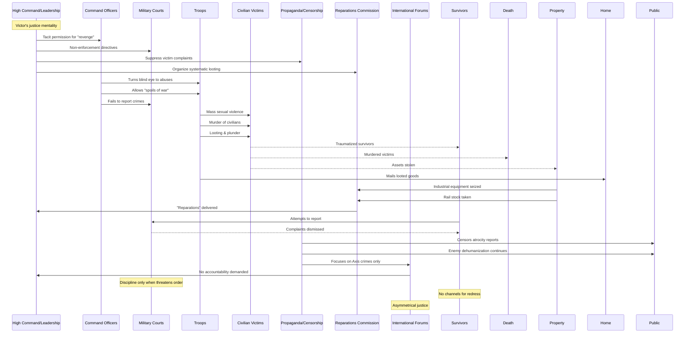

# Issue: Giving a Pass to War Crimes - Complicit Parties and Resource Flows

## Summary
Operational tolerance for atrocities including mass sexual violence and looting by victorious Soviet forces, with selective justice focused only on enemy crimes. This issue documents the complicit parties and resource flows enabling these unpunished war crimes.

## Sequence Diagram of Complicit Parties and Resource Flows

## Key Resource Flows

### Material Plunder
- **Industrial equipment** seized as "reparations"
- **Rail stock and infrastructure** taken wholesale
- **Personal property** looted and mailed home
- **Agricultural assets** stripped from occupied territories
- **Cultural artifacts** stolen systematically

### Authority Non-Enforcement
- **Prosecutorial discretion** to ignore Soviet crimes
- **Military court inaction** on reported atrocities
- **Command tolerance** for "revenge" actions
- **Censorship apparatus** suppressing complaints

### Power Dynamics
- **Victor's justice**: International focus on Axis crimes only
- **Dehumanization propaganda**: Enemy civilians as legitimate targets
- **Material incentives**: Looting as troop compensation
- **Chain-of-command culture**: Discouraging crime reporting
- **No survivor recourse**: Victims lack justice channels
- **Asymmetrical accountability**: Own crimes ignored
- **"Liberation" narrative**: Crimes hidden behind heroic framing

## Impact
- **2+ million German women** sexually assaulted
- **Countless civilians murdered** without accountability
- **Mass trauma** across occupied populations
- **Systematic economic stripping** of occupied territories
- **Justice denied** to victims
- **Precedent set** for military impunity
- **Historical denial** through censorship
- **Intergenerational trauma** from unacknowledged crimes
- **Poisoned post-war relations** with occupied nations