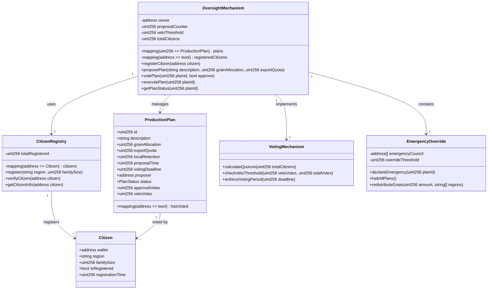

# Holodomor Oversight Mechanism - Solidity Implementation

## Mermaid Class Diagram



## Solidity Implementation

```solidity
// SPDX-License-Identifier: MIT
pragma solidity ^0.8.0;

contract HolodomorOversightMechanism {
    
    // Constants
    uint256 public constant VETO_THRESHOLD = 80; // 80% required for veto
    uint256 public constant VOTING_PERIOD = 7 days;
    uint256 public constant MINIMUM_RETENTION = 50; // Minimum 50% grain retention for locals
    
    // State variables
    address public administrator;
    uint256 public proposalCounter;
    uint256 public totalRegisteredCitizens;
    
    // Enums
    enum PlanStatus { 
        Proposed, 
        UnderReview, 
        Approved, 
        Vetoed, 
        Executed,
        Emergency 
    }
    
    enum VoteType { 
        Approve, 
        Veto 
    }
    
    // Structs
    struct Citizen {
        string region;
        uint256 familySize;
        bool isRegistered;
        uint256 registrationTime;
        uint256 grainAllocation;
    }
    
    struct ProductionPlan {
        uint256 id;
        string description;
        uint256 totalGrainProduction;
        uint256 exportQuota;
        uint256 localRetention;
        uint256 proposalTime;
        uint256 votingDeadline;
        address proposer;
        PlanStatus status;
        uint256 approvalVotes;
        uint256 vetoVotes;
        uint256 totalVotes;
        mapping(address => bool) hasVoted;
        mapping(address => VoteType) citizenVotes;
    }
    
    struct RegionalAllocation {
        string region;
        uint256 population;
        uint256 grainAllocation;
        uint256 minimumRequired;
    }
    
    // Mappings
    mapping(uint256 => ProductionPlan) public productionPlans;
    mapping(address => Citizen) public citizens;
    mapping(string => RegionalAllocation) public regionalAllocations;
    mapping(address => bool) public emergencyCouncil;
    
    // Events
    event CitizenRegistered(address indexed citizen, string region);
    event PlanProposed(uint256 indexed planId, uint256 exportQuota, uint256 localRetention);
    event VoteCast(uint256 indexed planId, address indexed voter, VoteType voteType);
    event PlanVetoed(uint256 indexed planId, uint256 vetoPercentage);
    event PlanApproved(uint256 indexed planId);
    event EmergencyDeclared(uint256 indexed planId, string reason);
    event GrainRedistributed(string region, uint256 amount);
    
    // Modifiers
    modifier onlyAdministrator() {
        require(msg.sender == administrator, "Only administrator can perform this action");
        _;
    }
    
    modifier onlyRegisteredCitizen() {
        require(citizens[msg.sender].isRegistered, "Must be registered citizen");
        _;
    }
    
    modifier planExists(uint256 _planId) {
        require(_planId > 0 && _planId <= proposalCounter, "Plan does not exist");
        _;
    }
    
    modifier votingActive(uint256 _planId) {
        require(
            productionPlans[_planId].status == PlanStatus.UnderReview &&
            block.timestamp <= productionPlans[_planId].votingDeadline,
            "Voting period not active"
        );
        _;
    }
    
    constructor() {
        administrator = msg.sender;
    }
    
    // Citizen Registration
    function registerCitizen(string memory _region, uint256 _familySize) external {
        require(!citizens[msg.sender].isRegistered, "Already registered");
        require(_familySize > 0, "Invalid family size");
        
        citizens[msg.sender] = Citizen({
            region: _region,
            familySize: _familySize,
            isRegistered: true,
            registrationTime: block.timestamp,
            grainAllocation: 0
        });
        
        totalRegisteredCitizens++;
        regionalAllocations[_region].population += _familySize;
        
        emit CitizenRegistered(msg.sender, _region);
    }
    
    // Plan Proposal
    function proposePlan(
        string memory _description,
        uint256 _totalGrainProduction,
        uint256 _exportQuota
    ) external onlyAdministrator returns (uint256) {
        require(_totalGrainProduction > 0, "Invalid production amount");
        require(_exportQuota < _totalGrainProduction, "Export exceeds production");
        
        uint256 localRetention = _totalGrainProduction - _exportQuota;
        uint256 retentionPercentage = (localRetention * 100) / _totalGrainProduction;
        
        require(
            retentionPercentage >= MINIMUM_RETENTION,
            "Local retention below minimum threshold"
        );
        
        proposalCounter++;
        ProductionPlan storage newPlan = productionPlans[proposalCounter];
        
        newPlan.id = proposalCounter;
        newPlan.description = _description;
        newPlan.totalGrainProduction = _totalGrainProduction;
        newPlan.exportQuota = _exportQuota;
        newPlan.localRetention = localRetention;
        newPlan.proposalTime = block.timestamp;
        newPlan.votingDeadline = block.timestamp + VOTING_PERIOD;
        newPlan.proposer = msg.sender;
        newPlan.status = PlanStatus.UnderReview;
        
        emit PlanProposed(proposalCounter, _exportQuota, localRetention);
        
        return proposalCounter;
    }
    
    // Voting Mechanism
    function votePlan(uint256 _planId, VoteType _voteType) 
        external 
        onlyRegisteredCitizen
        planExists(_planId)
        votingActive(_planId)
    {
        ProductionPlan storage plan = productionPlans[_planId];
        require(!plan.hasVoted[msg.sender], "Already voted");
        
        plan.hasVoted[msg.sender] = true;
        plan.citizenVotes[msg.sender] = _voteType;
        plan.totalVotes++;
        
        if (_voteType == VoteType.Veto) {
            plan.vetoVotes++;
        } else {
            plan.approvalVotes++;
        }
        
        emit VoteCast(_planId, msg.sender, _voteType);
        
        // Check if veto threshold reached
        if (plan.totalVotes > 0) {
            uint256 vetoPercentage = (plan.vetoVotes * 100) / plan.totalVotes;
            if (vetoPercentage >= VETO_THRESHOLD) {
                plan.status = PlanStatus.Vetoed;
                emit PlanVetoed(_planId, vetoPercentage);
            }
        }
    }
    
    // Finalize Voting
    function finalizePlan(uint256 _planId) 
        external 
        planExists(_planId)
    {
        ProductionPlan storage plan = productionPlans[_planId];
        require(
            block.timestamp > plan.votingDeadline,
            "Voting period not ended"
        );
        require(
            plan.status == PlanStatus.UnderReview,
            "Plan already finalized"
        );
        
        if (plan.totalVotes == 0) {
            plan.status = PlanStatus.Approved;
            emit PlanApproved(_planId);
            return;
        }
        
        uint256 vetoPercentage = (plan.vetoVotes * 100) / plan.totalVotes;
        
        if (vetoPercentage >= VETO_THRESHOLD) {
            plan.status = PlanStatus.Vetoed;
            emit PlanVetoed(_planId, vetoPercentage);
        } else {
            plan.status = PlanStatus.Approved;
            emit PlanApproved(_planId);
        }
    }
    
    // Emergency Override
    function declareEmergency(uint256 _planId, string memory _reason) 
        external 
    {
        require(emergencyCouncil[msg.sender], "Not emergency council member");
        ProductionPlan storage plan = productionPlans[_planId];
        plan.status = PlanStatus.Emergency;
        emit EmergencyDeclared(_planId, _reason);
    }
    
    // Grain Redistribution for Emergency
    function redistributeEmergencyGrain(
        string memory _region,
        uint256 _amount
    ) external {
        require(emergencyCouncil[msg.sender], "Not emergency council member");
        regionalAllocations[_region].grainAllocation += _amount;
        emit GrainRedistributed(_region, _amount);
    }
    
    // View Functions
    function getPlanDetails(uint256 _planId) 
        external 
        view 
        returns (
            uint256 id,
            string memory description,
            uint256 exportQuota,
            uint256 localRetention,
            PlanStatus status,
            uint256 approvalVotes,
            uint256 vetoVotes
        ) 
    {
        ProductionPlan storage plan = productionPlans[_planId];
        return (
            plan.id,
            plan.description,
            plan.exportQuota,
            plan.localRetention,
            plan.status,
            plan.approvalVotes,
            plan.vetoVotes
        );
    }
    
    function getVotingProgress(uint256 _planId) 
        external 
        view 
        returns (
            uint256 totalVotes,
            uint256 vetoPercentage,
            uint256 timeRemaining
        ) 
    {
        ProductionPlan storage plan = productionPlans[_planId];
        uint256 vetoPercent = plan.totalVotes > 0 ? 
            (plan.vetoVotes * 100) / plan.totalVotes : 0;
        uint256 remaining = plan.votingDeadline > block.timestamp ? 
            plan.votingDeadline - block.timestamp : 0;
            
        return (plan.totalVotes, vetoPercent, remaining);
    }
    
    // Emergency Council Management
    function addEmergencyCouncilMember(address _member) 
        external 
        onlyAdministrator 
    {
        emergencyCouncil[_member] = true;
    }
    
    function removeEmergencyCouncilMember(address _member) 
        external 
        onlyAdministrator 
    {
        emergencyCouncil[_member] = false;
    }
}
```

## Key Features

1. **Citizen Registration**: Every citizen must register with their region and family size to participate in voting.

2. **Production Plan Proposals**: Administrator proposes grain production plans specifying total production, export quotas, and local retention.

3. **80% Veto Mechanism**: Citizens can veto any plan if 80% or more vote against it, preventing harmful export quotas.

4. **Minimum Retention Requirement**: Enforces at least 50% grain retention for local consumption.

5. **Emergency Override**: Emergency council can halt plans and redistribute grain during crises.

6. **Regional Tracking**: Tracks grain allocation by region to ensure equitable distribution.

7. **Transparent Voting**: All votes are recorded on-chain with full transparency.

8. **Time-bound Voting**: 7-day voting period for each proposal to ensure timely decisions.

This mechanism would have provided citizens with democratic oversight over grain production and export decisions, potentially preventing the catastrophic policies that led to the Holodomor famine.